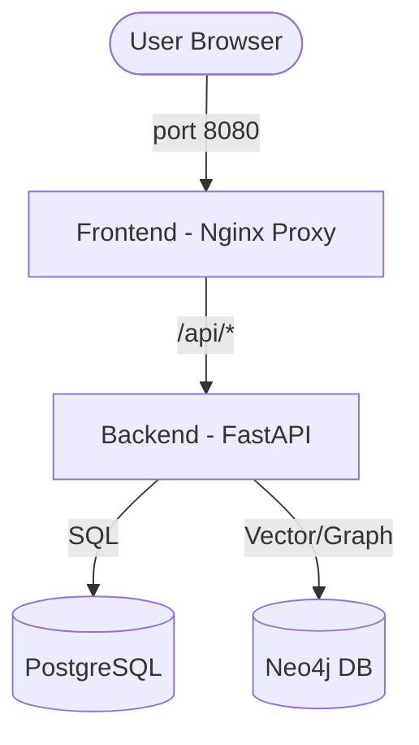

# 🚀 Simple Crew Builder


**Simple Crew Builder** is a premium, open-source visual orchestrator for **CrewAI**. It empowers developers and AI enthusiasts to design, configure, and execute complex Multi-Agent systems through a stunning, intuitive drag-and-drop interface.

> "The best way to predict the future is to invent it." — Alan Kay

With the arrival of **v0.0.4**, Simple Crew Builder now features **Long-Term Memory** powered by **Neo4j**, enabling agents to learn and persist knowledge using advanced RAG (Retrieval-Augmented Generation).

---

## ✨ Key Features (v0.0.4)

- **Visual Workflow Designer**: Orchestrate Agents, Tasks, and Crews using a powerful React Flow canvas.
- **🧠 Knowledge Base (RAG) Engine**: Use Neo4j as a vector store to give your agents "Long-Term Memory".
- **📁 Enterprise Code Parsing**: Upload entire repositories via `.zip` files. Our engine intelligently indexes codebases (React, Python, COBOL, etc.) while ignoring junk folders.
- **High-End UI**: Manage Knowledge Bases, upload documents, and watch agents "think" in real-time with a sleek, cyberpunk-inspired dashboard.
- **MCP Native**: Full support for Model Context Protocol (MCP) servers and custom Python tools.
- **Zero Friction Deployment**: Ready to run with a single command — no environment configuration required for initial testing.

---

## 🚀 Quick Start (Zero Friction)

Experience the power of Simple Crew Builder in less than 2 minutes. Our production setup is designed to be **Plug & Play**.

### 1. Download the orchestration file
Save the [docker-compose.yml](docker-compose.yml) to a folder on your machine.

### 2. Launch the stack
Open your terminal in that folder and run:
```bash
docker compose up -d
```
*Note: No `.env` file is required for local testing. The system uses secure defaults for all internal databases.*

### 3. Access & Gear Up
Open **[http://localhost:8080](http://localhost:8080)** in your browser.

> [!TIP]
> **API Configuration:** Once the UI is open, go to `Settings -> Models` to add your **OPENAI_API_KEY**. No need to restart containers or edit system files!

---

## 🛠 Tech Stack

- **Orchestration:** [CrewAI](https://www.crewai.com/) (Multi-Agent Framework)
- **Frontend:** React 19 + Vite + Tailwind CSS v4 + React Flow
- **Backend:** Python 3.12 + FastAPI
- **Database:** PostgreSQL 15 (Configurations & State)
- **Knowledge Base:** Neo4j 5.23 (Graph & Vector Store)
- **Infrastructure:** Docker & Docker Compose

---

## 🐳 Docker Architecture & Production



### Advanced Deployment (Cloud/Production)
For production environments, you can customize credentials and security:
1. Copy [.env.example](.env.example) to `.env`:
   ```bash
   cp .env.example .env
   ```
2. Edit `.env` to set strong passwords for `POSTGRES_PASSWORD` and `NEO4J_PASSWORD`.
3. Restart the stack: `docker compose up -d`.

---

## 📁 Project Structure

```text
simple-crew-builder/
├── simple-crew-backend/    # FastAPI backend & CrewAI logic
├── simple-crew-front/      # React frontend (Vite & Nginx)
├── docker-compose.yml      # 🐳 Production-ready (Docker Hub images)
├── docker-compose.dev.yml  # 🔧 For local development & hot reload
└── .env.example            # Template for custom production settings
```

---

## 🤝 Contributing

This is an **Open Source** project and we ❤️ contributions! 

1. **Fork** the repository.
2. **Create** a feature branch (`git checkout -b feature/AmazingFeature`).
3. **Commit** your changes (`git commit -m 'Add some AmazingFeature'`).
4. **Push** to the branch (`git push origin feature/AmazingFeature`).
5. **Open** a Pull Request.

---

## 👨‍💻 Author

Created with ❤️ by **[Gleison Souza](https://www.linkedin.com/in/gleisonlsouza/)**

---

## 📜 License

Distributed under the MIT License. See `LICENSE` for more information.

---

*Let your imagination run wild and build the future of AI agents today!*
en Source** project and we ❤️ contributions! 
Whether it's a bug report, a new feature, or a documentation improvement, feel free to open a Pull Request or Issue.

1. Fork the Project
2. Create your Feature Branch (`git checkout -b feature/AmazingFeature`)
3. Commit your Changes (`git commit -m 'Add some AmazingFeature'`)
4. Push to the Branch (`git push origin feature/AmazingFeature`)
5. Open a Pull Request

---

## 👨‍💻 Author

Created with ❤️ by **[Gleison Souza](https://www.linkedin.com/in/gleisonlsouza/)**

---

## 📜 License

Distributed under the MIT License. See `LICENSE` for more information.

---

*Let your imagination run wild and build the future of AI agents today!*
